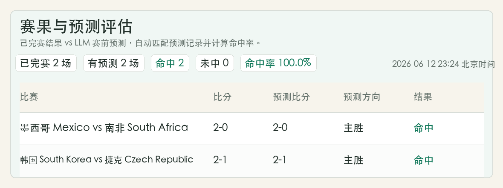

# Worldcut 2026

2026 世界杯预测与模拟盘网页工具。页面以中国体育彩票竞彩网固定奖金为主数据源，结合 LLM 分析、双轨背离评分和模拟资金账户，生成赛前预测、AI 复核与模拟下注记录。

## 在线预览

[打开当前部署页面](http://154.219.104.230:8765/)

## 功能

- 自动读取中国体育彩票竞彩网世界杯固定奖金。
- 以体彩售卖列表为主渲染比赛卡片。
- 展示胜平负概率、赔率走势、模拟盘建议和 AI 分析。
- 支持 LLM 自动生成模拟下注计划。
- 支持多用户模拟账户，按账户 ID 区分资金、持仓和 LLM 下注历史。
- LLM 下注历史、持仓和账户状态保存到后端 SQLite。
- 支持移动端页面适配。

## 本地运行

```bash
cd /root/worldcup-predictions
OPENAI_API_KEY="你的 OpenAI 兼容 API Key" \
OPENAI_BASE_URL="https://你的 OpenAI 兼容接口地址" \
OPENAI_MODEL="gpt-5.5" \
SPORTTERY_HTTP_PROXY="http://127.0.0.1:7890" \
python3 server.py
```

默认服务地址：

```text
http://0.0.0.0:8765/
```

## 环境变量

| 变量 | 说明 |
| --- | --- |
| `OPENAI_API_KEY` | LLM 接口 Key，不要写入仓库。 |
| `OPENAI_BASE_URL` | OpenAI 兼容接口地址。 |
| `OPENAI_MODEL` | LLM 模型名。 |
| `SPORTTERY_HTTP_PROXY` | 仅用于访问中国体育彩票接口的本地 HTTP 代理。 |
| `PORT` | 服务端口，默认 `8765`。 |
| `SEARCH_API_URL` | 可选，外部搜索 API。 |

## 数据与安全

仓库不会提交运行数据库、日志、代理配置或密钥。以下文件已被 `.gitignore` 忽略：

```text
prediction_history.sqlite3
server.log
sing-box*.json
*.log
.env
```

`server.py` 只从环境变量读取 API key，不包含真实密钥。

## 说明

本项目只用于预测研究和模拟盘复盘，不提供真实下注能力，也不构成投注建议。

## 赛果复盘截图



